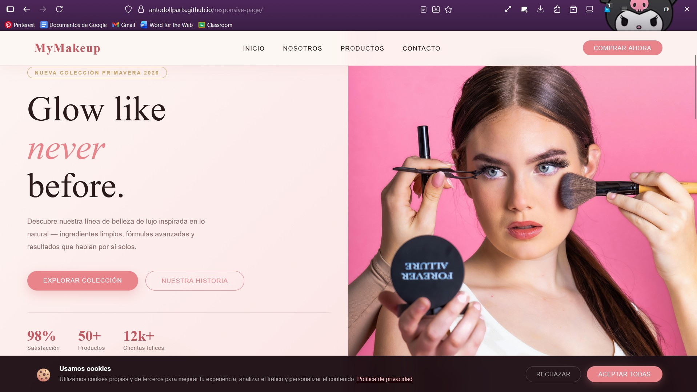
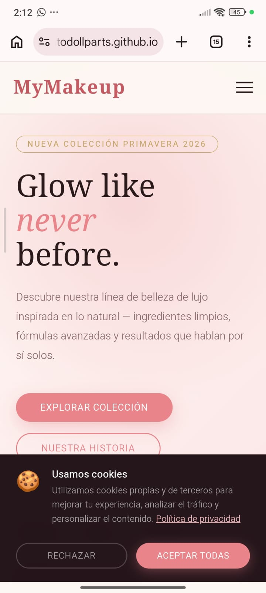
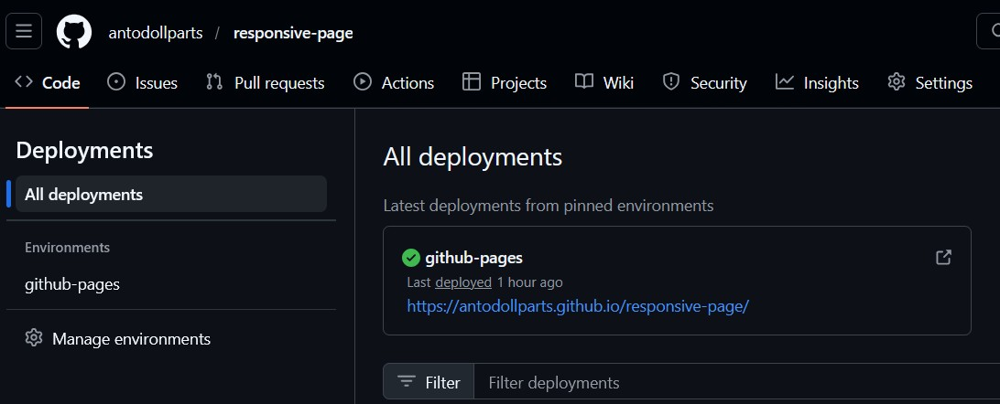

# Evidencias del Proyecto

## Landing Page Responsiva

### Vista Desktop

### Vista Móvil

---

## GitHub Pages Activo

Captura de pantalla en:
Settings → Pages mostrando la URL activa.

URL del sitio:
https://antodollparts.github.io/responsive-page/

---

## Aprendizajes

### 1. ¿Qué fue lo más fácil y lo más retador?

- Lo más fácil fue pensar en el maquetado de mi página.

- Lo más retador fue implementar correctamente estilos CSS y funcionalidades en javascript para el estilo responsive.

---

### 2. ¿Qué partes de HTML semántico y Flexbox usaste y por qué?

Utilicé etiquetas como:
- `<header>` para la parte del encabezado en la parte superior
- `<nav>` para la navegación
- `<main>` para el contenido principal
- `<section>` para dividir las secciones del contenido
- `<footer>` para el pie de página

Porque mejoran la accesibilidad, el SEO y la organización del código.

En Flexbox utilicé propiedades como:
- display: flex;
- flex-direction: column;
- flex-wrap: wrap;
- justify-content: center;
- align-items: center;

Para mejorar la alineación y posición de elementos dentro de contenedores flex.

---

### 3. ¿Cómo organizaste tus media queries y breakpoints?

El proyecto usa enfoque desktop first el CSS base está escrito para pantallas grandes y las media queries reducen o adaptan hacia pantallas menores. Se usaron media queries considerando estos breakpoints

- Tablet: max-width 900px
- Móvil: max-width 580px

---

### 4. ¿Qué mejorarías en la siguiente iteración?

- Agregar modo claro/oscuro
- Optimizar imágenes